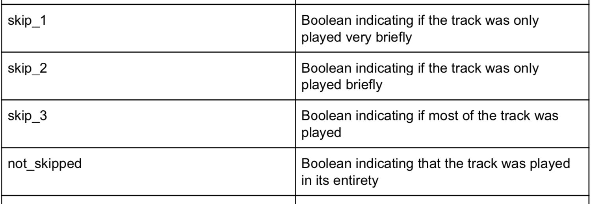
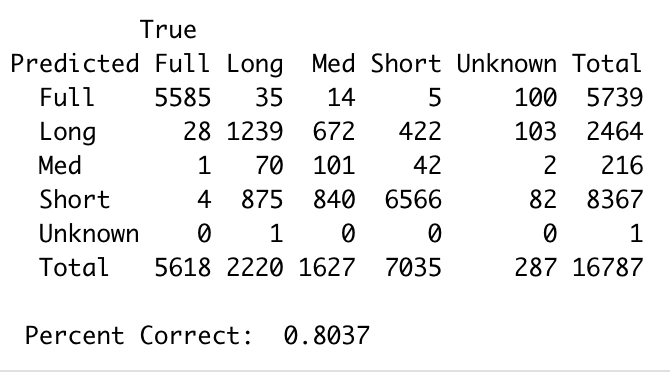
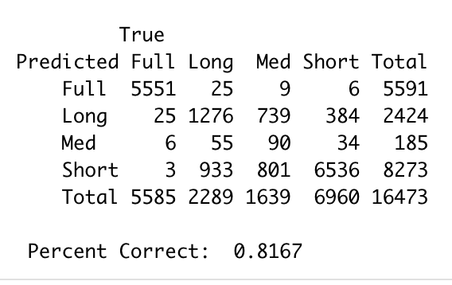
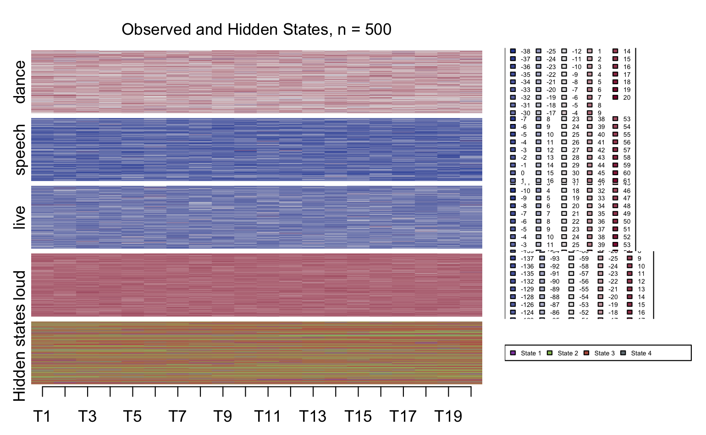

# Introduction

Streaming services like Spotify and Last.fm have drastically changed the way we listen to music. People have an unprecedented quantity and variety of songs available at the touch of a button -- or even the uttering of a command. Likewise, music creators and distributors have massive amounts of data available on listeners behavior. In this article we'll explore one of these streaming datasets to identify interesting patterns and causal relationships using data mining techniques.

The Music Streaming Sessions Dataset (*see* Brost et al.) was assembled and released by Spotify to enable public research into listener behavior. Specifically, they were interested in predicting whether a user would skip a given song in a listening session. The first part of this article will focus on the prediction task. RNNs were the winning models (*see* Hansen et al.), but here we will apply other classification methods to the data for the purpose of illustrating their comparative performance. 

While song skipping behavior is certainly important, this dataset contains a trove of acoustic and behavioral information on 150 million listening sessions (we only use a small fraction because of computational limitations), so we wanted to go beyond the binary prediction task and research the sessions themselves for patterns. In the second part of this article we will apply Sequential Analysis methods borrowed from sociology to visualize and cluster the sessions as sets of time-series. 

To conclude, we will briefly discuss how Sequence Analysis and visualizations relate back to the prediction task by indicating which modeling directions are worth pursuing.

# Classification
Machine Learning can be a useful tool for many sorts of problems. One of the most common type of problem is classification. This tutorial will give an in-depth approach to solving these types of problems. For the purpose of this tutorial we will be using the spotify sequential skip prediction data set which can be found here {https://www.crowdai.org/challenges/spotify-sequential-skip-prediction-challenge}

## Data Loading and Cleaning pt. 1
The first thing to do is to load the data which in this case can be done using the read.csv() function. You can then view the loaded data using View() and you can see the structure of the data using str().
```{r}
set.seed(10201998)
#assuming the dcsv files are in your rstudio project folder
data <- read.csv("log_mini.csv")
str(data)
```
To keep this simple our goal will be to predict whether or not a song will be skipped. This information can be seen in the 'not_skipped' column. Now you might notice that this column contains the test words 'true' and 'false'. Unfortunately most if not all Machine learning tools cannot work with test inputs. Thus we need to convert this to a binary representation. This can be done pretty easily in R. (note:specific columns in a dataframe can be accessed with the $ operator followed by the name of the column)
```{r}
data$not_skipped = as.logical(data$not_skipped)
str(data)
```
If you go back to the view of data you can now see that the 'not_skipped' column contains 'TRUE' and 'FALSE'. This may seem like text but under the hood R represents these as 0s and 1s. You'll probably also notice that there are a number of other columns with text 'true' and 'false values. You can go ahead and convert these as well.
```{r}
data$skip_1 = as.logical(data$skip_1)
data$skip_2 = as.logical(data$skip_2)
data$skip_3 = as.logical(data$skip_3)
data$hist_user_behavior_is_shuffle = as.logical(data$hist_user_behavior_is_shuffle)
data$premium = as.logical(data$premium)
str(data)
```

The as.logical function can also handle binary representations and while not always necessary, for the sake of consistency you can convert the binary columns to logical as well.
```{r}
data$context_switch = as.logical(data$context_switch)
data$no_pause_before_play <- as.logical(data$no_pause_before_play)
data$short_pause_before_play <- as.logical(data$short_pause_before_play)
data$long_pause_before_play <- as.logical(data$long_pause_before_play)
data$hist_user_behavior_n_seekfwd <- as.logical(data$hist_user_behavior_n_seekfwd)
data$hist_user_behavior_n_seekback <- as.logical(data$hist_user_behavior_n_seekback)
str(data)
```
## Logistic Regression

Now that we have a bunch of numeric data we can start modeling! One of the most basic tools for this is logistic regression. Logistic Regression is a modified version of linear regression where instead of fitting a line to the data we fit it to the log-odds. Then that line is transformed into probability space using the inverse logit (logistic) transformation. The line equation takes the form \href{https://en.wikipedia.org/wiki/Logistic_regression}{[1]}:
$$ \hat Y = \hat\beta_0 + \hat\beta_1X_1 + \hat\beta_2X_2+...+\hat\beta_NX_N$$
And the inverse logit transformation is:
$$logit^{-1}(\alpha)= \frac{exp(\alpha)}{1+exp(\alpha)}$$


In R you can fit a logistic regression using the glm() function with the setting family=binomial(link=logit). You can use as many variables as you want to make predictions so we might as well use all the data we can. Because more information is always better, right? (This is actually very wrong but I will get into that later). So I will use all of the numeric data that we have (except for skip_1-3 because they are analogs for not_skipped). (Note: The formula paramter in the glm should be in the form (y ~ x1 + x2 +...)).

```{r}
glm = glm(not_skipped ~ session_position + session_length + context_switch + no_pause_before_play + 
            short_pause_before_play + long_pause_before_play + hist_user_behavior_n_seekfwd +
            hist_user_behavior_n_seekback + hist_user_behavior_is_shuffle + hour_of_day + premium ,family = binomial(),data = data)
```
Now that you have a model you want to test it, right? Well, The common practice to evaluate models is to split whatever data using you are using into train and test sets. So we'll re-run this model after splitting the data. You want generally want to maximize the amount of training data, but you also need a sufficient number of rows to test on. For this example we'll reserve 10% of the data for training.

```{r}
indx = sample(dim(data)[1],dim(data)[1]%/%10)
test  = data[indx,]
train = data[-indx,]

glm = glm(not_skipped ~ session_position + session_length + context_switch + no_pause_before_play + 
            short_pause_before_play + long_pause_before_play + hist_user_behavior_n_seekfwd +
            hist_user_behavior_n_seekback + hist_user_behavior_is_shuffle + hour_of_day + premium ,binomial(link = logit),data = train)
```
Now that we've retrained the model we want to test it. First off we want to make predictions, which can be done using the predict() function.
```{r}
p = predict(glm,newdata = test,type = 'response')
```

Then we want to see how it did. There are many ways we can do this.

## Model Evaluation

One of the simplest ways to evaluate a model is accuracy (i.e. what percentage of the predictions did the model get right).
This can simply be done by adding up the number of correct predictions and then divide it by the total number of predictions. However, the predict function with type = 'response' returns a probability that not_skipped is TRUE thus we need to decide on a threshold for classifying something as TRUE. For simplicity we'll say that if the prediction is greater than 50% we will classify it as TRUE. Then we'll calculate the accuracy.

```{r}
p_tf = p>.5
accuracy = sum(p_tf==test$not_skipped)/length(p_tf)
accuracy
```
Now this is obviously a terrible model.I will introduce is a confusion matrix. A confusion mtrix for a binary categorization divides all of the predictions into true/false positives and true/false negatives. You can produce a confusion matrix pretty easily with the dplyr package. 

```{r}
library(dplyr)
frame = tibble(true=test$not_skipped,pred=p_tf)
conf_mat = (frame %>% group_by(true,pred) %>% count())$n %>% matrix(ncol = 2,nrow=2,dimnames = list(c('True','False'),c('True','False')))
conf_mat
```
The top left is true positives, top right is false positives, the bottom left is false negatives and the bottom right is true negatives. From this matrix we can see that there are a large number of false positives and few false negatives. We can conclude that this model over-estimates positives. From this we can also calculate the class precision and recall which allows us to compare values across different test sets. 
```{r}
precision= c(conf_mat[1,1]/sum(conf_mat[,1]),conf_mat[2,2]/sum(conf_mat[,2]))
recall = c(conf_mat[1,1]/sum(conf_mat[1,]),conf_mat[2,2]/sum(conf_mat[2,]))
print(list(precision=precision,recall=recall))
```
While the True precision is good, the other metrics are pretty low. 
The last evaluation metric I will introduce is the ROC curve. When calculating accuracy we have to choose a threshold, The ROC curve plots the True positive rate versus the false negative rate for different probability thresholds. The ROCR package can be used to make a ROC curve pretty easily.
```{r}
library(ROCR)
rocr = prediction(p,test$not_skipped)
roc = performance(rocr,'tpr','fpr')
plot(roc)
```

The closer this line is to y=x the worse it is. We can quantify this with AUC (Area Under the Curve). The closer AUC is to one, the better the model. An AUC score of .5 is the same as a totally random chance. We can compute the model AUC in R using the performance function from ROCR.
```{r}
auc_obj = performance(rocr,'auc')
auc = auc_obj@y.values[[1]]
auc
```
Again this shows that the model is pretty bad. ROC/AUC is fairly broadly applicable, however, your model must produce probabilities and not just categorizations. Regardless of the metric our initial model is not very good. So, the next step is step is to try incorporate better/more data. Luckily, The provided data set includes a second table with metrics on all of the songs.


## Data Cleaning pt2: Continuous variables and joining
```{r}
songs = read.csv('tf_mini.csv')
str(songs)
```
Looking at this new data you'll notice its mostly numeric data there are however some things don't necessarily make much sense as numeric data like time_signature and key. So, first off we'll change those to be factors.
```{r}
songs$key = as.factor(songs$key)
songs$time_signature = as.factor(songs$time_signature)
```
Now, the rest of the numeric data seems to make sense, but there is one more thing to do before we merge the two tables: standardizing our variables. In statistics it's common practice to standardize numeric data because it converts those numbers into a measure of how far above/below the mean a number is. In R the function scale() can do this for us automatically. We'll also usd the rapply() function to allow us to scale all of the numeric columns in one command. 
```{r}
songs$duration = as.numeric(songs$duration)
songs_scaled = rapply(songs, scale,c('numeric'),how='replace')
```
Now we can join the two tables together. The full_join() function will allow us to link all of the play data from the first table with data about the song that is being played from the songs table. 

```{r}
total_data = full_join(data, songs_scaled,by = c("track_id_clean" = "track_id"))
```

Now that we have a lot of numeric data lets run a new model to see whether it improved our predictions.
```{r}
#This is a faster way to get the formula term for glm so you don't have to write it out 
##remove potentiql rsponse variables
temp_data = subset(total_data,select=-c(not_skipped,skip_1,skip_2,skip_3))
##grab class types
classes = sapply(temp_data,class)
##add numeri/logical/int column names to list
columns = c()
for( i in 1:length(classes)){
  temp = classes[i]
  if(temp =='int'|temp=='logical'|temp=='numeric'|temp=='matrix'){
    columns = c(columns,colnames(temp_data)[i])
  }
}
f = paste(columns,sep='',collapse = ' + ')
fla = as.formula (paste(c('not_skipped ~ ',f),collapse =''))
#Don't forget to split the data into test/train sets

train_numeric = total_data[-indx,]
test_numeric = total_data[indx,]


glm_numeric = glm(fla,family = binomial(),data = train_numeric)
p_numeric = predict(glm_numeric,newdata = test_numeric,type='response')
```
```{r}
p_numeric_tf = p_numeric > .5
frame_numeric = tibble(true=test_numeric$not_skipped,pred=p_numeric_tf)
conf_mat_numeric = (frame %>% group_by(true,pred) %>% count())$n %>% matrix(ncol = 2,nrow=2,dimnames = list(c('True','False'),c('True','False')))
conf_mat_numeric

rocr_numeric = prediction(p_numeric,test_numeric$not_skipped)
roc_numeric = performance(rocr_numeric,'tpr','fpr')
plot(roc_numeric)

auc_obj_numeric = performance(rocr_numeric,'auc')
auc_numeric = auc_obj_numeric@y.values[[1]]
auc_numeric
```
We can see that adding this data actually made our model get worse. Adding data that is not correlated with your desired prediction variable can cause the model to cometo erroneous conclusions. By accessing the $coefficients for your glm you can see how much each feature effects our prediction.
```{r}
glm_numeric$coefficients
```
So, how do we know what data to use and not to use? One way is to just keep testing the model with different combinations of variables and see which one is best, but..... there's not much math to back up that approach and it can be very time consuming. Luckily, there are some slight changes to the logistic regression model to help us solve this problem.

## Penalized Models

Penalized Regression is an improvement upon general logistic regression, that forces regression parameters to shrink and, if the data has no effect on the model prediction then the coefficient will shrink to 0. There are 3 main types: Lasso, Ridge, and Elastic. The general formula for each coefficient is:
$$ \hat \beta = arg_\beta min\{ l(\beta) + \lambda P(\beta) \} $$
You'll notice that there is the term \lambda term in this equation. This value is generally found through a grid search and then the \lambda with the best results is chosen

The glmnet package will allow us to easily use these methods. 

glmnet notes:

1) In the glmnet() function just add the parameter alpha = 0 for Ridge, alpha = 1 for Lasso and alpha = [some value between 0 and 1] for Elastic.

2) glmnet functions do not take a formula parameter, you have to manually divide up your data frame X(predictor columns) and Y(predicted variable)

3)glmnets do not like dataframes so you must convert them to matricies before putting them into the function.

In terms of part 2 and 3 we are lucky in that R has a built in function that does most of it for us called model.matrix. Just load the formula we created along with the data frame and it outputs a correctly formatted X matrix. Then you just have to separate the Y column off the original and youre good to go.

```{r}
X_lasso = model.matrix(fla, data = total_data)
Y_lasso = total_data$not_skipped
#Split test/train

X_lasso_test = X_lasso[indx,]
X_lasso_train = X_lasso[-indx,]
Y_lasso_test = Y_lasso[indx]
Y_lasso_train = Y_lasso[-indx]
```
Now lets run cv.glmnet, which uses n-fold cross validation to sort the ]\lambda values by a specified metric. We'll use auc since that's one of the evaluation metrics that we've created. For this example I've deciced to use lasso regression but you are welcome to choose a different alpha value to see how it effects the results.
```{r}
library(glmnet)
lasso = cv.glmnet(X_lasso_train,Y_lasso_train,type.measure = 'auc',alpha=1,family='binomial')
```
Now, that this is done we can check the beta values and see what variables are wothwhile to keep.
```{r}
coefs = coef.glmnet(lasso,s=c(lasso$lambda.min))
coefs
```
We can now see that beat_strength, bounciness, danceability, dyn_range_mean, energy, loudness, organism, speechiness, valence and sevral acoustic vectors have coefficients of effectively 0.
So, we can remove them. However, lets first check our evaluation metrics and see if lasso has improved our model at all. Instead of manually calculating all of our evaluation metrics again, glmnet has some built-in functions to do that for us.
```{r}
confusion.glmnet(lasso,newx=X_lasso_test,newy = Y_lasso_test)
measure_lasso = assess.glmnet(lasso,newx=X_lasso_test,newy = Y_lasso_test)
measure_lasso$auc[[1]]
```
Unfortunately, It does not seem to have changed our metrics much, but it at least informs us about what data seems unnecessary. There is still more data to investigate however so I will hold off on that for the moment.

## Data Cleaning pt3: Categorical Variables
AS I mentioned early on, most models cannot incorporate text as data. However, there is a way to do this if you interpret a text column as a category with a number of subcategories. In R the data type factor was created to account for this categorical data. If a category has N subcategories/levels we can convert them into N-1 True/False values (also called dummy variables) through one-hot encoding. Our friend from earlier model.matrix has built-in functionality for factor encoding. Going back to the formula we used earlier we can add in our categorical variables with a '- 1' after them to convert them into one-hot format. You do however need to be smart about what you convert. If you look at the track_id column you might notice that there are over 50,000 levels. This would mean adding over 50,000 extra columns onto our data sets, which would be enormously computationally expensive. Thus I am omitting track_id, session_id and date (along with the previously omitted skip1-3s) from consideration. 
```{r}
temp_data2 = subset(total_data,select=-c(not_skipped,skip_1,skip_2,skip_3,session_id,track_id_clean,date))

cl2 = sapply(temp_data2, class)
ps2 = sapply(cl2, function(x){
  return(ifelse(x=='factor','-1',''))
})
f_cat =  paste(colnames(temp_data2),ps2,collapse = " + ",sep = '')
fla_cat = as.formula(paste(c('~ ',f_cat),collapse = '',sep=''))
#>>>>>>>>>>>>>
X_cat = model.matrix(fla_cat,data=total_data)
```
Now with those categoricals converted lets see how they affect our predictions!
```{r}
X_cat_test = X_cat[indx,]
X_cat_train = X_cat[-indx,]
Y_cat_test = total_data$not_skipped[indx]
Y_cat_train = total_data$not_skipped[-indx]

lasso_cat = cv.glmnet(X_cat_train,Y_cat_train,type.measure = 'auc',alpha=1,family='binomial')
```
```{r}
confusion.glmnet(lasso_cat,newx=X_cat_test,newy = Y_cat_test)
measure_lasso = assess.glmnet(lasso_cat,newx=X_cat_test,newy = Y_cat_test)
measure_lasso$auc[[1]]
```
Based on the very high AUC score we can see that this categorical data drastically improved our model. Let's check the coefficients and see which variables did the most work and which ones we can take out. 
```{r}
cat_coefs = coef.glmnet(lasso_cat,s=c(lasso_cat$lambda.min))
cat_coefs
```
Now lets drop those uneeded columns and recheck our predictions

```{r}
drop_ind = cat_coefs == 0 
sum(drop_ind)
drop = c()
for(i in 1:length(cat_coefs@Dimnames[[1]])){
  if(drop_ind[i]){
    drop = c(drop,i-1)
  }
}
X_cat_red = X_cat[,-drop]
X_cat_red_test = X_cat_red[indx,]
X_cat_red_train = X_cat_red[-indx,]
Y_cat_red_test = total_data$not_skipped[indx]
Y_cat_red_train = total_data$not_skipped[-indx]

lasso_cat_red = cv.glmnet(X_cat_red_train,Y_cat_red_train,type.measure = 'auc',alpha=1,family='binomial')
```

```{r}
confusion.glmnet(lasso_cat_red,newx=X_cat_red_test,newy = Y_cat_red_test)
measure_red_lasso = assess.glmnet(lasso_cat_red,newx=X_cat_red_test,newy = Y_cat_red_test)
measure_red_lasso$auc[[1]]
```
We Can see from this that despite the fact that we dropped 19 out of 74 variables there was essentially no change in performance. This is good because the more variables there are, the longer it takes to train/predict and the more likely we will start overfitting a model. 

# Multiple Classification
Now that we've succeeded in a relatively simple problem, let's try something more complex: Multiple Classification. If you read the data documentation you'll find the definitions for the different skip categories
```{r,echo=FALSE}

```
Given that these all give information about the same thing we can more or less consider these as dummy variables for a single categorical column with 5 levels. If we look at the possible combinations of these 4 variables we see that there are 6 categories but one of them has only one observation. 
```{r}
total_data %>% group_by(skip_1,skip_2,skip_3,not_skipped) %>% count()
```
If we consider the possibility that this single observation is an error it would support my assertion that these are analogs to dummy variables. Our next task will be to make model to predict this 5 level categorical. Thus, the first task is to create a new column to represent that.

```{r}
## First drop the error column 
dim(total_data)
total_data2 = total_data %>% filter(!(skip_2==TRUE & total_data$skip_3==FALSE))
dim(total_data2)
total_data2 %>% group_by(skip_1,skip_2,skip_3,not_skipped) %>% count()
listen_time = rep('',length(total_data2$skip_1))
for (i in 1:length(listen_time)) {
  if(total_data2$not_skipped[i]){
    listen_time[i] = 'Full'
  }else if(total_data2$skip_1[i]){
    listen_time[i] = 'Short'
  }else if(total_data2$skip_2[i]){
    listen_time[i] = 'Med'
  }else if(total_data2$skip_3[i]){
    listen_time[i] = 'Long'
  }else{
    listen_time[i] = 'Unknown'
  }
}
total_data2$listen_time = listen_time

total_data2 %>% group_by(skip_1,skip_2,skip_3,not_skipped,listen_time) %>% count()
```
With this accomplished we need consider what modeling tools we can use. There are many ways to go about a multiple classification problem. One is to do one-vs.-rest modeling where you fit a logistic function to each category and then classify that observation as whichever class had the highest predicted probability. This is also known as Multinomial Logistic Regression, which glmnet handles. All you have to do is change the family parameter on your glmnet model from 'binomial' to 'multinomial'. (Note: Because AUC relies on having True positives and False positives, it no longer makes sense in a multi-class setting and can no longer be applied)

```{r}
temp_data_listen = subset(total_data2,select=-c(not_skipped,skip_1,skip_2,skip_3,session_id,track_id_clean,date,listen_time))

cl_listen = sapply(temp_data_listen, class)
ps_listen = sapply(cl_listen, function(x){
  return(ifelse(x=='factor','-1',''))
})
f_listen =  paste(colnames(temp_data_listen),ps_listen,collapse = " + ",sep = '')
fla_listen = as.formula(paste(c('~ ',f_listen),collapse = '',sep=''))
#>>>>>>>>>>>>>
X_listen = model.matrix(fla_listen,data=total_data2)
```
```{r}
indx_listen = sample(length(listen_time),length(listen_time)%/%10)
X_listen_train = X_listen[-indx_listen,]
X_listen_test = X_listen[indx_listen,]
Y_listen_train = total_data2$listen_time[-indx_listen]
Y_listen_test = total_data2$listen_time[indx_listen]
```
Warning: Training this model may take a long time.
```{r,eval=FALSE}
lasso_listen = cv.glmnet(X_listen_train,Y_listen_train,family='multinomial',alpha=1)
```

```{r,eval=FALSE}
listen_conf = confusion.glmnet(lasso_listen,newx = X_listen_test,newy=Y_listen_test)
listen_conf
```
```{r}
# The model takes a very long time to run so a screenshot of the results was taken to allow for faster knitting


```
Based on the confusion matrix this model does reasonably well in 3 of the 5 categories. Med is quite weak with most of the true Med's being predicted as either short or long and the unkown category performs teribly. Unknown is only predicted as the most likely category  once. This suggests a number of possibilities. First, that there are not enough Unkown classifications in the data for the model to develop "confidence" in predicting that class. Another possibility is that these are simply errors in the data collection and they should actually be in one of the other classes. If either of these are true it makes some sense to remove that data for now and restest the model without it.

```{r}
total_data3 = total_data2 %>% filter(listen_time!='Unknown')
temp_data_listen3 = subset(total_data3,select=-c(not_skipped,skip_1,skip_2,skip_3,session_id,track_id_clean,date,listen_time))

cl_listen3 = sapply(temp_data_listen3, class)
ps_listen3 = sapply(cl_listen3, function(x){
  return(ifelse(x=='factor','-1',''))
})
f_listen3 =  paste(colnames(temp_data_listen3),ps_listen3,collapse = " + ",sep = '')
fla_listen3 = as.formula(paste(c('~ ',f_listen3),collapse = '',sep=''))
#>>>>>>>>>>>>>
X_listen3 = model.matrix(fla_listen3,data=total_data3)

indx_listen3 = sample(length(total_data3$listen_time),length(total_data3$listen_time)%/%10)
X_listen_train3 = X_listen3[-indx_listen3,]
X_listen_test3 = X_listen3[indx_listen3,]
Y_listen_train3 = as.factor(total_data3$listen_time[-indx_listen3])
Y_listen_test3 = as.factor(total_data3$listen_time[indx_listen3])

```
```{r,eval=FALSE}
lasso_listen3 = cv.glmnet(X_listen_train3,Y_listen_train3,family='multinomial',alpha=1)
listen_conf3 = confusion.glmnet(lasso_listen3,newx = X_listen_test3,newy=Y_listen_test3)
listen_conf3
```
```{r}
# The model takes a very long time to run so a screenshot of the results was taken to allow for faster knitting


```
Even having dropped the unkowns the results only improved marginally. But we've incorporated pretty much all of the data that was given to us, so where do we go from here? One option is to test out the same model but with different alpha values. Another is to try out other types of models like Discriminant Analysis or Naive Bayes. A third option is to change our perspective on the data.

# Sequence Analysis

**TraMineR**, **seqHMM**, and sequence analysis in general, were designed for and have been primarily applied to sociological data such as life course analysis (*see*: Gabadinho et al.; Helske et al.). The assumption of the sociological domain is built into the packages to an extent: TraMineR requires start and end points to be specified for each sequence step, and accepts ages or calendar years as values (). Thus, adapting it to listening session data required a bit of fudging, i.e., each session step is given an "age-range" from its position in the sequence to the next position in the sequence. For example, song 1 has a start point of 1 and an endpoint of 2. 

Sequential music listening behavior has been studied using other methods (*see*: Cheng et al.), but to the best of our knowledge this is the first application of Hidden Markov Models and the above-referenced R packages to the problem. 

### Additional pre-processing
<<<<<<< HEAD
The dataset has 4 boolean values corresponding to whether a track was played very briefly, briefly, most of the way through, or all the way through. Initially, we assumed that these 4 attributes were a one-hot encoding of how long a song was played before being skipped. We later noticed that for some observations, more than one value would be true, so apparently a song was both played only briefly and played most of the way through. Several thousand observations have every value set to false. We discarded these observations as we were unsure if they were erroneous or otherwise how to interpret them. For purposes of sequence analysis, we discarded the "skip" variables and instead used the variable describing how a user ended a song (hist_user_behavior_reason_end) to indicate skips, i.e. if the reason was "trackdone" we assumed the song was not skipped. 
=======
>>>>>>> 353232645296e7170c2d588da19bf8886fa36da5

```{r import sts files, include=FALSE}
library(tidyr)
library(plyr)
library(seqHMM)
library(TraMineR)
library(RColorBrewer)
library(colorspace)
library(MASS)
skip <- read.csv("Sequence Analysis/skip_sequences.csv", row.names = 1)
context <- read.csv("Sequence Analysis/context_sequences.csv", row.names = 1)
year <- read.csv("Sequence Analysis/year_sequences.csv", row.names = 1)
dance <- read.csv("Sequence Analysis/dance_sequences.csv", row.names = 1)
beat <- read.csv("Sequence Analysis/beat_sequences.csv", row.names = 1)
bounce <-read.csv("Sequence Analysis/bounce_sequences.csv", row.names = 1)
energy <- read.csv("Sequence Analysis/energy_sequences.csv", row.names = 1)
flat <- read.csv("Sequence Analysis/flat_sequences.csv", row.names = 1)
inst <- read.csv("Sequence Analysis/inst_sequences.csv", row.names = 1)
live <- read.csv("Sequence Analysis/live_sequences.csv", row.names = 1)
loud <- read.csv("Sequence Analysis/loud_sequences.csv", row.names = 1)
speech <- read.csv("Sequence Analysis/speech_sequences.csv", row.names = 1)
temp <- read.csv("Sequence Analysis/temp_sequences.csv", row.names = 1)
val <- read.csv("Sequence Analysis/val_sequences.csv", row.names = 1)
seekfwd <- read.csv("Sequence Analysis/seekfwd_sequences.csv", row.names = 1)
seekbk <- read.csv("Sequence Analysis/seekbk_sequences.csv", row.names = 1)
start <- read.csv("Sequence Analysis/start_sequences.csv", row.names = 1)
pop <- read.csv("Sequence Analysis/pop_sequences.csv", row.names = 1)
pause <- read.csv("Sequence Analysis/pause_sequences.csv", row.names = 1)
```
In total, we created 18 sequence objects, each representing one channel of user behavior: e.g. song dance-ability and tempo; song release decade, etc. Below is the code used to create one sequence object for the release decade of songs:
```{r sequence example, results = "hide", message=FALSE}
# year_seq <- seqformat(Sequence_Train, from = "SPELL", to = "STS", id = 1, begin = 2, end = end, status = 'release_year', process = F) <--- used to convert dataframe format. Original dataframe not included in this tutorial because of size. 

#distinct(Sequence_Train, skip_1,skip_2,skip_3)
Sequence_Train$length 
year <- read.csv("Sequence Analysis/year_sequences.csv", row.names = 1)
decade_sequence <- seqdef(year, var = 2:21, cpal = sequential_hcl(7,"SunsetDark"))
```
Note that year_sequences.csv was pre-processed using the seqformat() function to convert the data from SPELL format to the STS format that **TraMineR** expects. SPELL format uses multiple rows for every obsservation, where each row is a step in that observation's sequence. STS format has one row per observation and represents each step as a column attribute. **TraMineR** and **seqHMM** are also specific to discrete state sequences. Continuous variables representing acoustic track features, such as "beat-strength", "energy", and "dance-ability" were converted to discrete scores by first normalizing them, then multiplying by 10 and rounding to the nearest integer. Finally, we converted release years to release decades to reduce the number of states and enhance visual interpretability of the plots.  In the next section we will explore some tools to help us understand potential time trends in our data before we try adding them into our models.

<<<<<<< HEAD
### Visual Sequence Analysis 

=======
```{r define sequences}
skip_sequence <- seqdef(skip, var = 2:21, states = c("appload","backbtn","clickrow","endplay","fwdbtn","logout","remote","no skip"),alphabet = c("1", "2", "3", "4", "5", "6", "7","no_skip"), cpal = diverge_hcl(8,"Tropic"))
context_sequence <- seqdef(context, var = 2:21)
dance_sequence <- seqdef(dance, var = 2:21, cpal = diverge_hcl(61,"Blue-Red"))
beat_sequence <- seqdef(beat, var = 2:21, cpal = diverge_hcl(63,"Blue-Red"))
bounce_sequence <- seqdef(bounce, var = 2:21, cpal = diverge_hcl(55,"Blue-Red"))
start_sequence <- seqdef(start, var = 2:21, cpal = colorpalette[[8]])
energy_sequence <- seqdef(energy, var = 2:21, cpal =  diverge_hcl(56,"Blue-Red"))
flat_sequence <- seqdef(flat, var = 2:21, cpal =  diverge_hcl(212,"Blue-Red"))
inst_sequence <- seqdef(inst, var = 2:21, cpal =  diverge_hcl(71,"Blue-Red"))
live_sequence <- seqdef(live, var = 2:21, cpal =  diverge_hcl(68,"Blue-Red"))
loud_sequence <- seqdef(loud, var = 2:21, cpal =  diverge_hcl(168,"Blue-Red"))
pop_sequence <- seqdef(pop, var = 2:21, cpal =  diverge_hcl(111,"Blue-Red"))
seekbk_sequence <- seqdef(seekbk, var = 2:21, cpal = sequential_hcl(31,"SunsetDark"))
seekfwd_sequence <- seqdef(seekfwd, var = 2:21, cpal = sequential_hcl(20,"SunsetDark"))
speech_sequence <- seqdef(speech, var = 2:21, cpal =  diverge_hcl(73,"Blue-Red"))
temp_sequence <- seqdef(temp, var = 2:21, cpal =  diverge_hcl(65,"Blue-Red"))
val_sequence <- seqdef(val, var = 2:21, cpal =  diverge_hcl(45,"Blue-Red"))
```
TraMineR sequence objects have built-in plotting methods. We can plot the distribution of states in each sequence step, a selected sample of sequences, or the frequency of the most common sequence. The frequency plots have limited value for long sequences with many possible states, as the high variation means very few sequences will be identical, so the most common sequences may still be quite rare. 

<<<<<<< HEAD
Below are plots of a selection of state channels. We immediately see that sessions tend to remain in one context, i.e. not switch between playlist types, and context does not account for much variation in skipping behavior. This relates back to feature selection for the prediction task. 
```{r plots, fig.height = 14, fig.width=8, echo = FALSE, message=FALSE}
# Plots
plot_ub1 <- ssp(list(skip_sequence[200:400,], start_sequence[200:400,]),
sortv = "from.start", sort.channel = 1, type = "I",
ylab = c("Skip", "Song Start"),
xtlab = 1:20, xlab = "Session Position", title = "200 User Behavior Sequences",
title.n = FALSE, legend.prop = 0.4, ylab.pos = c(2, 2), cex.legend = .8,
ncol.legend = c(1, 2))

plot_ub2 <- ssp(list(skip_sequence[200:400,], start_sequence[200:400,]),
sortv = "from.start", sort.channel = 1, type = "d",
ylab = c("Skip", "Song Start"),
xtlab = 1:20, xlab = "Session Position", title = "User Behavior Distributions",
title.n = FALSE, legend.prop = 0.4, ylab.pos = c(2, 2), cex.legend = .8,
ncol.legend = c(1, 2), border = NA)

plot_ub3 <- ssp(list(skip_sequence[200:400,], context_sequence[200:400,]),
sortv = "from.start", sort.channel = 1, type = "I",
ylab = c("Skip", "Context"),
xtlab = 1:20, xlab = "Session Position", title = "Song Context vs. Skipping",
title.n = FALSE, legend.prop = 0.4, ylab.pos = c(2, 2), cex.legend = .8,
ncol.legend = c(1, 1), border = NA)

plot_ub4 <- ssp(list(skip_sequence[200:400,], context_sequence[200:400,]),
sortv = "from.start", sort.channel = 2, type = "I",
ylab = c("Skip", "Context"),
xtlab = 1:20, xlab = "Session Position", title = "Song Context vs. Skipping Sorted by Context",
title.n = FALSE, legend.prop = 0.4, ylab.pos = c(2, 2), cex.legend = .8,
ncol.legend = c(1, 1), border = NA)

plot_track1 <- ssp(list(decade_sequence[200:400,], dance_sequence[200:400,],beat_sequence[200:400,]),
sortv = "from.start", sort.channel = 2, type = "I",
ylab = c("Decade", "Dance-iness", "Beat Strength"),
xtlab = 1:20, xlab = "Session Position", title = "200 Track Feature Sequences",
title.n = FALSE, legend.prop = 0.4, ylab.pos = c(2, 2,2), cex.legend = .8,
ncol.legend = c(1, 6,6))

plot_track2 <- ssp(list(energy_sequence[200:400,], live_sequence[200:400,],inst_sequence[200:400,]),
sortv = "from.start", sort.channel = 1, type = "I",
ylab = c("Energy", "Liveness", "Instrumentalness"),
xtlab = 1:20, xlab = "Session Position", title = "200 Track Feature Sequences",
title.n = FALSE, legend.prop = 0.4, ylab.pos = c(2, 2,2), cex.legend = .8,
ncol.legend = c(6, 6,6))

plot_track3 <- ssp(list(speech_sequence[200:400,], temp_sequence[200:400,],val_sequence[200:400,]),
sortv = "from.start", sort.channel = 1, type = "I",
ylab = c("Speechiness", "Tempo", "Valence"),
xtlab = 1:20, xlab = "Session Position", title = "200 Track Feature Sequences",
title.n = FALSE, legend.prop = 0.4, ylab.pos = c(2, 2,2), cex.legend = .8,
ncol.legend = c(6, 6,6))

plot_track4 <- ssp(list(dance_sequence[200:400,],beat_sequence[200:400,],energy_sequence[200:400,], live_sequence[200:400,],inst_sequence[200:400,],speech_sequence[200:400,], temp_sequence[200:400,],val_sequence[200:400,]),
sortv = "from.start", sort.channel = 1, type = "d",
ylab = c("Dnc", "Beat", "En", "Live", "Instr", "Speech", "Temp", "Val"),
xtlab = 1:20, xlab = "Session Position", title = "Track Feature Distributions",
title.n = FALSE, legend.prop = .1, ylab.pos = c(2, 1,2,1,2,1,2,1), cex.legend = .1,
ncol.legend = c(6,6,6,6,6,6,6,6),border = NA)
class(plot_ub1)
seq_plots <- list(plot_ub1,plot_ub2, plot_ub3,plot_ub4,plot_track1, plot_track2, plot_track3, plot_track4)

gridplot(seq_plots[1:4], nrow =4, ncol = 1,with.legend = "FALSE",legend.pos = "right")

gridplot(seq_plots[5:7], nrow = 2, ncol =2, with.legend = F)

```
Exceptions can be as interesting as trends: the track feature plots reveal one session with an unusual number of instrumental tracks and several with noticeably high valence (aka positivity; *see* Spotify "Get Audio Features" page). 

### HMMs

Hidden Markov Models assume that observed sequential data is generated by an unobserved sequential process which obeys the Markov assumption. As with clustering, optimizing an HMM is dependent on a manually specified number of states. Below we use the **seqHMM** package to fit an HMM to selected channels of our data. 

*Note: the fit_model function has been commented out as it can take quite awhile to run. Relavent output was saved to disk. 
```{r hidden states}
channels = list(dance_sequence, speech_sequence, live_sequence, loud_sequence)
names = c("dance", "speech", "live", "loud")
#track_model <- build_hmm(observations = channels, n_states = 4, channel_names = )
#track_fit <- fit_model(track_model)
#write.matrix(track_fit$model$transition_probs, "hidden_state_transition_probs")
#ssplot(track_fit$model, plots = "both", type = "I", tlim = 1:500, border = NA, ylab = c("dance","speech", "live", "loud"), cex.legend = .4, ncol.legend = 5, title = "Observed and Hidden States")
trans_mat <- read.csv("hidden_state_transition_probs", header = TRUE)
print(trans_mat)

```
The table above is the state transition matrix from the HMM, which indicates that the states seqHMM 
has found tend to remain constant over sequences. The plot confirms this. The relationship between channels and hidden states is unclear, largely due to the large number of channel states. Condensing these states into range categories in the future may produce more interpretable results. 

# Conclusions

Sequential analysis of time-series may guide more efficient binary prediction models. If we take into consideration that that each row contains a session_id and and session position tag we can see that these observations are actually sequential. When data is collected over time it can be influenced by trends over time. This is known as autocorrelation. One way of dealing with this is to say that the state of an observation in some sequence is influenced by previous observations in that sequence. This can be modeled using lag-N autocorrelation. This simply means that you include state of the observation N time steps before the current observation. Now, you may have noticed that as our models became more complex, it took drastically longer to train them. This means that with large models it becomes inefficient and computationally expensive to just try new things until they work. So, one way to cut down on this is to investigate and visualize potential directions before actually applying them to the model. Sequences and time-series naturally lend themselves to visualization because change over time is something that is easily understood graphically.

Mixture Markov Models or Markov Models, with or without hidden states, may be an effective representation of music streaming sessions and their relationships. Intuitively, it seems plausible that present listening behavior will depend on the immediate past of listening behavior. For example, the song I am listening to right now puts me in a mood which will influence which song I'd like to hear next. At the same time, listening sessions take place in an overall context such as a commute to work or a big party, which may also influence their behavior. Mixture Markov Models can capture both state transition behavior and overall sequence behavior. Further exploration of this possibility will require condensing track features into a smaller number of discrete states and experimenting with different combinations of channels or cluster numbers. 

# References
*Brost, Brian, Rishabh Mehrotra, and Tristan Jehan. “The Music Streaming Sessions Dataset.” ArXiv:1901.09851 [Cs], December 31, 2018. http://arxiv.org/abs/1901.09851.
*Cheng, Zhiyong, Jialie Shen, Lei Zhu, Mohan Kankanhalli, and Liqiang Nie. “Exploiting Music Play Sequence for Music Recommendation.” In Proceedings of the Twenty-Sixth International Joint Conference on Artificial Intelligence, 3654–60. Melbourne, Australia: International Joint Conferences on Artificial Intelligence Organization, 2017. https://doi.org/10.24963/ijcai.2017/511.
*“Deep Content-Based Music Recommendation,” n.d., 9.
*Gabadinho, Alexis, Gilbert Ritschard, Matthias Studer, and Nicolas Muller. “Mining Sequence Data in R with the TraMineR Package: A User’s Guide.” University of Geneva, Switzerland, n.d. http://mephisto.unige.ch/traminer/.
*“Get Audio Features for a Track.” Spotify, n.d. https://developer.spotify.com/documentation/web-api/reference/tracks/get-audio-features/.
*Hansen, Christian, Casper Hansen, Stephen Alstrup, Jakob Grue Simonsen, and Christina Lioma. “Modelling Sequential Music Track Skips Using a Multi-RNN Approach.” ArXiv:1903.08408 [Cs], March 20, 2019. http://arxiv.org/abs/1903.08408.
*Helske, Satu, and Jouni Helske. “Mixture Hidden Markov Models for Sequence Data: The SeqHMM Package in R.” Journal of Statistical Software 88, no. 3 (2019). https://doi.org/10.18637/jss.v088.i03.
*Penn State Department of Statistics. “10.2 - Autocorrelation and Time Series Methods,” n.d. https://newonlinecourses.science.psu.edu/stat462/node/188/.
*Porter, Michael. “Penalized Regression Lecture Notes: Ridge, Lasso, Elasticnet,” Fall 2019.
*Smyth, Padhraic. “Clustering Sequences with Hidden Markov Models,” n.d., 7.
*Wikipedia. “Logistic Regression,” n.d. https://en.wikipedia.org/wiki/Logistic_regression.
*Wikipedia. “Multiple Logistic Regression,” n.d. https://en.wikipedia.org/wiki/Multinomial_logistic_regression.


